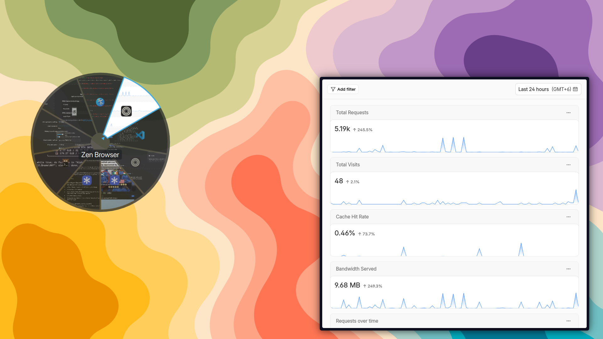

# Circular Alt+Tab

A radial Alt+Tab switcher for KDE Plasma 6.



Windows are arranged as pie slices around the cursor. Hover to select, click to activate, middle-click to close. Works with keyboard, mouse, and scroll wheel.

## Installation

Copy the repo into KWin's tabbox directory:

```bash
git clone https://github.com/YOUR_USERNAME/CircularAltTab-KWin.git
cp -r CircularAltTab-KWin ~/.local/share/kwin/tabbox/circular
```

Then select "Circular Alt+Tab" in System Settings → Window Management → Task Switcher.

Requires `qt6-5compat` for the opacity mask rendering:
```bash
# Fedora
sudo dnf install qt6-qt5compat

# Arch
sudo pacman -S qt6-5compat

# Ubuntu/Debian
sudo apt install qt6-5compat-dev
```

## Features

- Pie-slice window layout centered on cursor
- Live window thumbnails (icons for minimized windows)
- Mouse hover, click, scroll wheel, and keyboard navigation
- Multi-ring layout when you have more than 8 windows
- Middle-click to close windows
- Semi-transparent background that adapts to your Plasma theme

## Usage

| Input | Action |
|-------|--------|
| Alt+Tab | Open switcher |
| Hover | Highlight window |
| Click | Activate window |
| Middle-click | Close window |
| Scroll wheel | Cycle selection |
| Release Alt | Activate selected |

## Tuning

Edit `contents/ui/Pie.qml` to change visual defaults:

| Property | Default | What it does |
|----------|---------|--------------|
| `selectedScale` | 1.06 | Scale of the hovered piece |
| `nonSelectedOpacity` | 0.6 | Opacity of unselected pieces |
| `minimizedOpacity` | 0.7 | Opacity of minimized windows |
| `bgAlpha` | 0.72 | Background disc transparency |
| `captionFontScale` | 1.5 | Caption font size multiplier |

Or override in `main.qml` on the `Pie` instance:
```qml
Pie {
    selectedScale: 1.1
    bgAlpha: 0.9
}
```

## Development

Pure QML, no build step. Edit files in place, then reload:

```bash
# Safe — reloads Plasma shell only
plasmashell --replace

# Nuclear — kills your session apps
kwin_wayland --replace
```

**Structure:**

```
contents/ui/
  main.qml    — Entry point, window positioning, fade animation
  Pie.qml     — Ring layout, hit-testing, selection cycling
  Piece.qml   — Individual window sector (thumbnail, icon, accent ring)
```

**Implementation notes:**

- Hit-testing uses static geometry, not animated positions, to prevent hover thrashing
- Windows fill rings evenly (max 8 per ring); any remainder goes to the outer rings
- Single-window mode caps the slice at 180° (a full 360° circle is unusable)
- `model.activate()` and `model.close()` are undocumented KWin API — no stability guarantee

## Credits

Originally based on [PieTabSwitcher-KWin](https://github.com/Riflio/PieTabSwitcher-KWin) by Pavel K.

The current version has been substantially reworked:
- Multi-ring layout for large window counts
- Static-geometry hit-testing to prevent hover jitter
- Live window thumbnails with OpacityMask rendering
- Mouse, keyboard, and scroll wheel support
- Edge case handling (no windows, one window, minimized windows)
- Plasma 6 port (unversioned QML imports, Kirigami theme integration)
- User-tunable visual properties
- Caption contrast fix for light themes

## License

GPLv3 — see [LICENSE](LICENSE).
