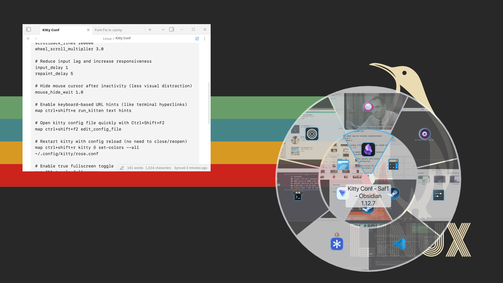

# Circular Alt+Tab

A circular Alt+Tab switcher for KDE Plasma 6.

<p align="center">
  
  
</p>

<p align="center">
  <sub>Wallpapers: <a href="https://basicappleguy.com/basicappleblog/topographic-amoeba">Topographic Amoeba</a> by Basic Apple Guy, <a href="https://www.reddit.com/r/wallpaper/comments/kcffkg/1920x1080_penguin_linux_wallpaper_dark_light_svg/">Penguin Linux Wallpaper</a> via r/wallpaper</sub>
</p>

Windows are arranged as pie slices around the cursor. Hover to select, click to activate, middle-click to close. Works with keyboard, mouse, and scroll wheel.

## Installation

### Option 1 - Manual copy

```bash
git clone https://github.com/lubdhak7414/CircularAltTab-KWin.git
cp -r CircularAltTab-KWin ~/.local/share/kwin/tabbox/circular
```

### Option 2 - Install script

```bash
git clone https://github.com/lubdhak7414/CircularAltTab-KWin.git
cd CircularAltTab-KWin
./install.sh
```

To install to a custom location:

```bash
./install.sh ~/.local/share/kwin/tabbox/circular
```

To uninstall:

```bash
./install.sh --uninstall
```

Then select "Circular Alt+Tab" in System Settings → Window Management → Task Switcher.

Requires `qt6-5compat` for the opacity mask rendering:
```bash
# Fedora
sudo dnf install qt6-qt5compat

# Arch
sudo pacman -S qt6-5compat

# Ubuntu/Debian
sudo apt install qt6-5compat-dev
```

## Compatibility

Tested on:

| Component | Version |
|-----------|---------|
| Plasma | 6.6.5 |
| KWin | 6.6.5 |
| Qt | 6.11.1 |
| Session | Wayland |
| Distro | CachyOS Linux |

Not tested on X11 or other Plasma 6.x point releases - reports welcome.

## Known Limitations

- `model.activate()` / `model.close()` are undocumented KWin TabBox API. A future Plasma update could break activation/close without warning.
- Closing a window with unsaved changes triggers that app's own confirmation dialog, same as any other close request - this plugin has no special handling for it.
- `OpacityMask` clipping of live thumbnails on Wayland is unverified on compositors other than KWin's own.
- Multi-monitor: verified on a mixed-resolution dual-monitor setup (1080p + 768p); other DPI/scale combinations are untested.
- No screen reader / accessibility support.
- Tested with 30 simultaneous windows (4 rings) on an RTX 3070: peak GPU SM utilization 52%, peak KWin CPU 40% of one core, idle between interactions - no sustained load or visible stutter at realistic-to-extreme window counts.

## Features

- Pie-slice window layout centered on cursor
- Live window thumbnails (icons for minimized windows)
- Mouse hover, click, scroll wheel, and keyboard navigation
- Multi-ring layout when you have more than 8 windows
- Middle-click to close windows
- Semi-transparent background that adapts to your Plasma theme

## Usage

| Input | Action |
|-------|--------|
| Alt+Tab | Open switcher |
| Alt+Shift+Tab | Open switcher, cycle backwards |
| Hover | Highlight window |
| Click | Activate window |
| Middle-click | Close window |
| Scroll wheel | Cycle selection |
| Release Alt | Activate selected |

## Tuning

Edit `contents/ui/Pie.qml` to change visual defaults:

| Property | Default | What it does |
|----------|---------|--------------|
| `selectedScale` | 1.06 | Scale of the hovered piece |
| `nonSelectedOpacity` | 0.6 | Opacity of unselected pieces |
| `minimizedOpacity` | 0.7 | Opacity of minimized windows |
| `bgAlpha` | 0.72 | Background disc transparency |
| `captionFontScale` | 1.5 | Caption font size multiplier |

Or override in `main.qml` on the `Pie` instance:
```qml
Pie {
    selectedScale: 1.1
    bgAlpha: 0.9
}
```

## Development

Pure QML, no build step. Edit files in place, then reload:

```bash
# Safe - reloads Plasma shell only
plasmashell --replace

# Nuclear - kills your session apps
kwin_wayland --replace
```

**Structure:**

```
contents/ui/
  main.qml    - Entry point, window positioning, fade animation
  Pie.qml     - Ring layout, hit-testing, selection cycling
  Piece.qml   - Individual window sector (thumbnail, icon, accent ring)
```

**Architecture notes:**

`TabBoxSwitcher → Window → Pie → Repeater → Piece`, rotation-based positioning, `OpacityMask` for annular sector clipping.

- Hit-testing reads static ring geometry, not animated/per-frame positions - prevents hover jitter when the hovered piece scales up
- Multi-ring distribution uses a remainder algorithm (`computeRingPieces()`); windows fill rings evenly (max 8/ring), remainder goes to outer rings
- Single-window mode caps the slice at 180° (a full 360° circle is degenerate)
- Icon sizing uses `Kirigami.Units` and tapers on narrow slices
- Background, captions, selection indicator, and fade animation use Kirigami theme colors

## Credits

Originally based on [PieTabSwitcher-KWin](https://github.com/Riflio/PieTabSwitcher-KWin) by Pavel K. Substantially reworked since (Plasma 6 port, multi-ring layout, live thumbnails, scroll support, theme integration) - see Architecture notes above for what changed.

## License

GPLv3 - see [LICENSE](LICENSE).
